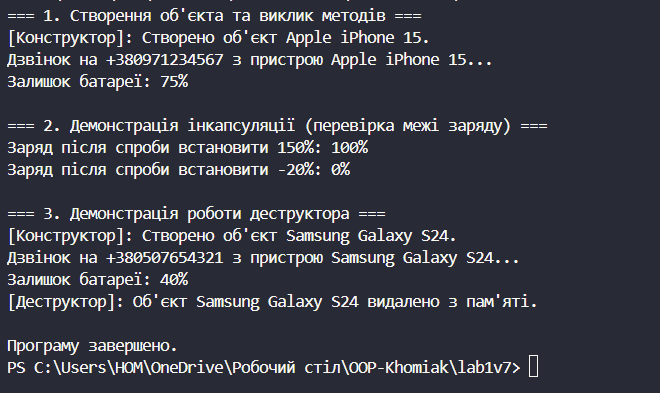

# Лабораторна робота №1
## Тема: Створення першого проєкту. Класи, об’єкти, конструктори та деструктори.Середовище розробки.
## Варіант 7. Клас Phone
* Поля: brand, model.
* Властивість: BatteryLevel.
* Метод: Call(string number).

# __Хід роботи:__

## Було створено консольний проєкт lab1v7 у директорії OOP-Khomiak. Відповідно до варіанту створив клас Phone. Клас містить: Приватні поля: бренд, модель та рівень заряду батареї. Публічні властивості для доступу до полів: Brand, Model та BatteryLevel. Для бренду і моделі передбачена перевірка на порожнє значення, а рівень заряду (доступний тільки для читання ззовні) має перевірку діапазону від 0 до 100. Перевантажені конструктори: один конструктор приймає бренд, модель та початковий рівень заряду, а другий - бренд та модель і викликає перший конструктор через: this(), встановлюючи початковий заряд 100. Метод: здійснення дзвінка - Call(). Метод перевіряє правильність введеного номера та наявність достатньої кількості заряду для дзвінка (зменшуючи його при успішній дії). Метод, що виконує дію, пов’язану з класом. Створив клас Program. У методі Main() було створено 3 об’єкти класу Phone. Для об’єктів був викликаний метод Call() та Console.WriteLine для виведення результатів програми. Для демонстрації роботи фіналізатора було використано GC.Collect() та GC.WaitForPendingFinalizers().

## Результат роботи:
### 