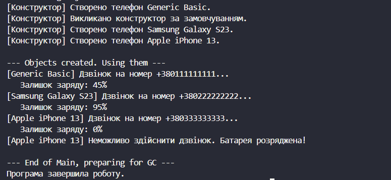

# Лабораторна робота №2
## __Тема:__ Клас із кількома конструкторами. Життєвий цикл об’єкта.
## Варіант: 7. Клас Phone
* Поля: _brand (string), _model (string), _batteryLevel (int).
* Властивості: Brand, Model, BatteryLevel (з валідацією: рівень батареї від 0 до 100).
* Конструктори: за замовчуванням (Brand=“Generic”, Model=“Basic”, BatteryLevel=50), параметризований (brand, model, batteryLevel).
* Метод: Call(string number) → виводить повідомлення про дзвінок та зменшує заряд
батареї.

# __Хід роботи:__
## Було встановлене середовище розробки VS Code з усіма необхідними розширеннями: C# Dev Kit; .NET Install Tool.
## Було створено консольний проєкт lab2v7 у директорії OOP-Khomiak. Відповідно до варіанту створив клас Phone. Клас містить: Приватні поля: _brand, _model та _batteryLevel. Публічні властивості для доступу до полів: Brand, Model та BatteryLevel. Для бренду і моделі передбачена перевірка на порожнє значення, а рівень батареї має валідацію діапазону від 0 до 100. Перевантажені конструктори: параметризований конструктор приймає бренд, модель та рівень батареї, а конструктор за замовчуванням викликає його через: this(), встановлюючи базові значення ("Generic", "Basic", 50). Метод, що виконує дію, пов’язану з класом: Call(). Метод перевіряє введений номер, виводить повідомлення про дзвінок та зменшує заряд батареї за наявності достатньої кількості заряду. Створив клас Program. У методі Main() було створено об’єкти класу Phone. Для об’єктів був викликаний метод Call() та Console.WriteLine для виведення результатів програми.

### 