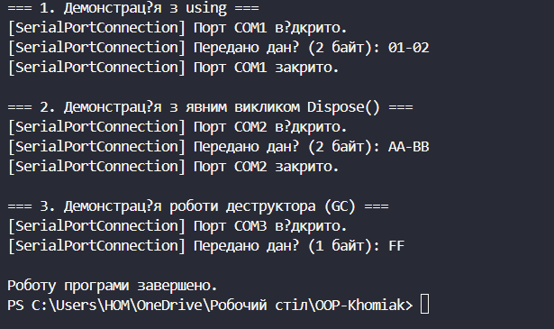

# Лабораторна робота № 3
### __Тема:__ Життєвий цикл об’єкта та керування ресурсами.
### Варянт:7. Клас SerialPortConnection
* Імітує з’єднання з серійним портом.
* Поля: _portName (string), _isPortOpen (bool).
* Метод: SendData(byte[] data).
* Dispose: “закриває порт”.

# __Хід роботи:__
### Було встановлене середовище розробки VS Code з усіма необхідними розширеннями: C# Dev Kit; .NET Install Tool.
### Було створено консольний проєкт lab3v7 у директорії OOP-Khomiak. Відповідно до варіанту створив клас SerialPortConnection. Клас містить: Приватні поля: назва порту _portName, стан порту _isPortOpen та прапорець очищення ресурсів _disposed. Публічні властивості для доступу до полів: PortName та IsPortOpen (тільки для читання). Конструктор: параметризований конструктор приймає назву порту та імітує виділення ресурсу (встановлює _isPortOpen = true). Метод, що виконує дію, пов’язану з класом: SendData(byte[] data). Метод перевіряє стан з'єднання і перед передачею даних переконується, що порт відкритий та об'єкт не знищений, інакше генерує виняток. Реалізацію патерну Dispose та інтерфейсу IDisposable: метод Dispose(), захищений віртуальний метод Dispose(bool disposing) для звільнення ресурсів, виклик GC.SuppressFinalize(this) та деструктор ~SerialPortConnection(), який викликає Dispose(false). Створив клас Program. У методі Main() було продемонстровано роботу з життєвим циклом об'єкта: з використанням конструкції using, з явним викликом Dispose(), а також демонстрацію роботи деструктора за допомогою GC.Collect() та GC.WaitForPendingFinalizers().

### Результат роботи:
### 