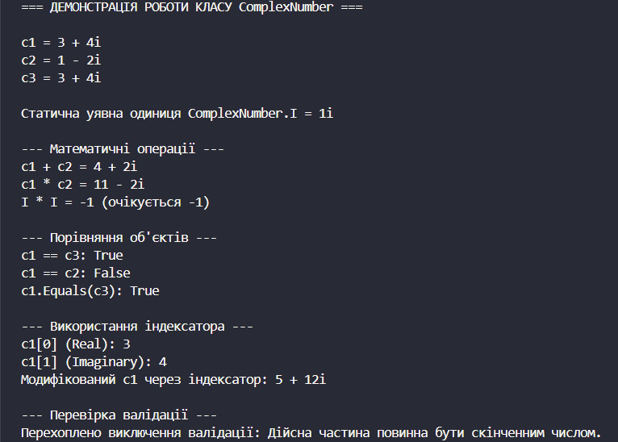

# Лабораторна робота №7
## __Тема:__ Властивості та статичні члени. Індексатори й перевантаження операторів.
## Варянт: 7. Клас ComplexNumber
* Поля: _real, _imaginary (double).
* Властивості: Real, Imaginary.
* Статичний член: I (властивість, що повертає ComplexNumber(0,1)).
* Перевантажені оператори: + (додавання), * (множення).
* Перевизначити ToString(), Equals(), GetHashCode(), ==, !=.

# __Хід роботи:__
 Було встановлене середовище розробки VS Code з усіма необхідними розширеннями: C# Dev Kit; .NET Install Tool.
 Було створено консольний проєкт lab4v7 у директорії OOP-Khomiak. Відповідно до варіанту створив клас ComplexNumber. Клас містить: Приватні поля: _real та _imaginary. Публічні властивості для доступу до полів: Real та Imaginary з валідацією, яка перевіряє значення та забороняє присвоєння некоректних даних (NaN та Infinity). Статичний член: властивість I, яка повертає об'єкт уявної одиниці (0, 1). Індексатор, що надає доступ до дійсної частини за індексом [0] та уявної частини за індексом [1]. Перевантажені оператори: + для додавання, * для множення за правилами комплексної арифметики, а також оператори порівняння == та !=. Перевизначені методи: ToString() для зручного відображення числа у стандартному математичному вигляді, Equals() для порівняння об'єктів з урахуванням точності чисел з плаваючою крапкою та GetHashCode() для хешування. Створив клас Program. У методі Main() було створено об’єкти класу ComplexNumber. Для об’єктів було продемонстровано використання всіх елементів: роботу з властивостями, перевірку валідації за допомогою блоку try-catch, звернення до статичного члена I, доступ та зміну полів через індексатор, виконання операцій + i * та порівняння об'єктів. Результати роботи програми виведено в консоль за допомогою Console.WriteLine.

 