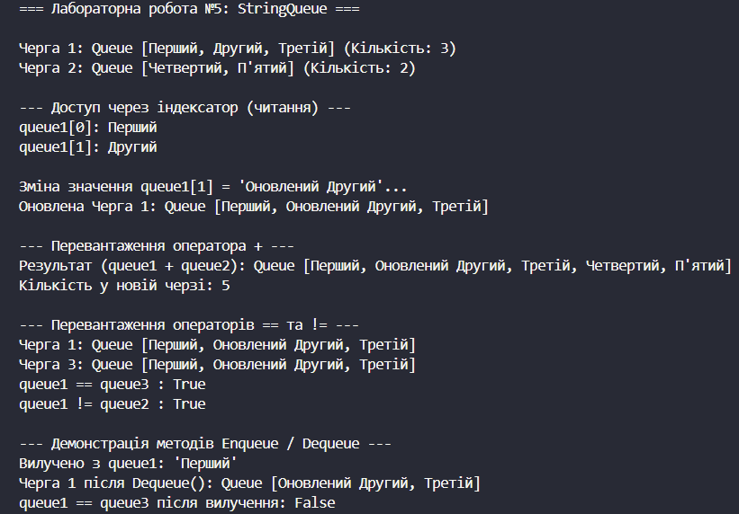

# Лабораторна робота №5
## __Тема:__ Індексатори та перевантаження операторів.
## Варіант: 7. Клас StringQueue (Черга, спрощена)
* Поле: List<string> _items.
* Індексатор: this[int index].
* Оператори: + (об’єднання черг), ==, !=.
* Додатково: Enqueue(string item), Dequeue(), Count.

# __Хід роботи:__
## Було встановлене середовище розробки VS Code з усіма необхідними розширеннями: C# Dev Kit; .NET Install Tool.
## Було створено консольний проєкт lab5v7 у директорії OOP-Khomiak. Відповідно до варіанту створив клас StringQueue. Клас містить: Приватне поле: _items типу List для зберігання елементів черги. Публічну властивість: Count для отримання поточної кількості елементів. Індексатор: this[int index] для читання та запису елементів за індексом із валідацією меж. Методи, пов'язані з чергою: Enqueue() для додавання елементів у кінець та Dequeue() для вилучення з початку. Перевантажені оператори: оператор + для об’єднання двох черг у нову, а також оператори == та != для перевірки черг на рівність за вмістом. Перевизначені методи: ToString() для зручного виведення вмісту, а також Equals() та GetHashCode() для коректного порівняння об'єктів. Створив клас Program. У методі Main() було створено об’єкти класу StringQueue. Для об’єктів було продемонстровано роботу індексатора (читання та зміну елементів), виклик методів Enqueue() і Dequeue(), об'єднання черг за допомогою оператора +, перевірку рівності операторами == і != та Console.WriteLine для виведення результатів програми.

