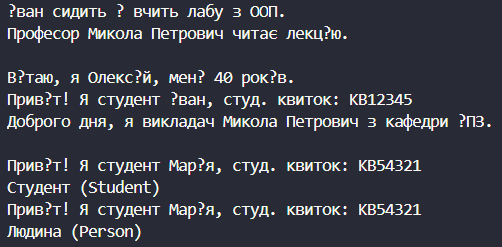

# Лабораторна робота №6
## Тема: Наслідування. Ключові слова base, override, virtual. Приховування членів (new).
## Варіант: 7. Ієрархія Person → Student → Professor
* Person (базовий): Name, Age, virtual void Greet(), string GetRole(), конструктор.

* Student (похідний): StudentId, override void Greet(), void Study(), new string GetRole(), конструктор base.

* Professor (похідний): Department, override void Greet(), void Teach(), конструктор base.

# __Хід роботи:__
Було встановлене середовище розробки VS Code з усіма необхідними розширеннями: C# Dev Kit; .NET Install Tool.
Було створено консольний проєкт lab6v7 у директорії OOP-Khomiak. Відповідно до варіанту створив ієрархію класів Person, Student та Professor. Клас Person (базовий) містить приватні поля name і age з відповідними публічними властивостями, конструктор для їх ініціалізації, віртуальний метод Greet() для реалізації поліморфізму та метод GetRole() для демонстрації приховування. Клас Student (похідний) успадковує Person, додає властивість StudentId, викликає конструктор базового класу за допомогою base(), перевизначає метод Greet() за допомогою override, має власний метод Study() та приховує метод GetRole() за допомогою ключового слова new. Клас Professor (похідний) успадковує Person, додає властивість Department, викликає конструктор базового класу через base(), перевизначає метод Greet() та містить власний метод Teach(). У класі Program в методі Main() було створено об’єкти всіх трьох класів. Для них продемонстровано виклик унікальних методів Study() і Teach(), поліморфний виклик перевизначеного методу Greet() через масив базового типу Person[], а також наочно показано різницю між override та new при виклику методів через посилання типу Student та посилання базового типу Person.

